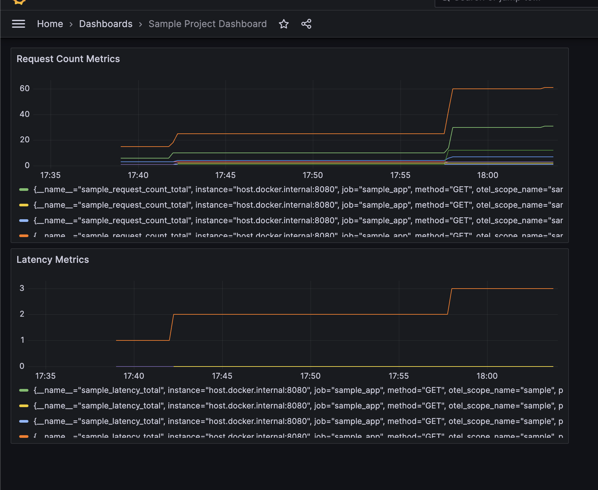

# Sample project

This is my sample project to try out different things for my POC purposes.

## Applications:

There are three applications at the moment of writing this README. The first one is sample, the second one is message and thid one is activity. All resides in the [cmd][cmd] directory.

There is [pkg][pkg] directory as well which contains common packages to be used by the applications.

Please note that this is not a showcase of go best practices. It just random code for my POC purpose.

### Sample:

I have tried following in the sample service:

- [viper][viper] package to read the configuration from yaml structure and to read the environment variables.
- [launchdarky][ldarkly] package to try out the launch darky flag configuration.
- [opentel][otel] package is a go framework to export the metrics and traces to different services.
- [prometheus][prom] Prometheus is a powerful metrics collector and is used to try out the basic metrics collection.
- [grafana][grafana] Grafana is a dashboarding and alerting tool to view the metrics from different sources by applying the different sets of conditions.
- [jaeger][jaeger] Jaeger is a distributed open source tracing platform with a good user interface.
- [flyway][flyway] Flyway tool to handle the database migration.
- [mux][mux] Mux is used for request routing handler.
- [traefik][traefik] Traefik provides a way for API management.

### Activity:

Along with couple things in Sample service, I have tried following:

- [gokit][gokit]: It provides toolkit to write beautiful microservice architecture.

### Message:

I have tried following in the message service:

- [cobra][cobra] To try out the command line tool with basic publish and reading from pub/sub.
- [protobuf][protobuf] To try out the serialization with protobuf library.
- [pubsub][pubsub] To try out the pub/sub messaging service using [emulator][pubsubemulator].
- [concurrency][goroutine] To try out the goroutine and channels for subscribing the messages from pub/sub.

## Try the application

There are certain dependencies that we have to install first before we can run the application. Those would be following:

- [golang][golang] ofcourse, with minimum version 1.20.
- [pubsub-emulator][pubsubemulator]
- [task][taskfile] to use the application provided commands to use the application.
- [protobuf][protobufdev] though, it can be installed using task command.
- [docker][docker] The pub/sub and mysql will be running inside the docker container.
- [golang-lint][golint] This is a tool to check the linting errors.
- [go-swagger][goswagger] It is a tool to generate the swagger documentation. It can be installed using given task command.

### Start the application

#### Sample Application:

- `task sample:init`: To set the environment files.
- `task sample:migrate`: To migrate the database.
- `task sample:start`: To start the sample application and its dependent services which are database, jaeger, grafana and prometheus.
- `task sample:stop`: To stop the database container and the service.
- `task all:down`: To stop all the services using one command.

### Activity Application:

- `task activity:init`: To set the environment files.
- `task activity:migrate`: To migrate the database.
- `task activity:start`: To start the activity application and its dependent services which are database, jaeger, grafana and prometheus.
- `task activity:stop`: To stop the database container and the service.
- `task all:down`: To stop all the services using one command.

#### Message Application:

There are certain task commands to run the applications. Lets go step by step:

- `task message:setup-deps`: To install the `protobuf` dependency.
- `task message:init`: To set the environment files and generate the code from proto definitions.
- `task message:pubsub:up`: To start the pub/sub emulator as a docker container. Please note that this will run the foreground process, so you need to open a new tab for next commands. Keep it running please.
- `task message:read`: This will create the topic and subscription if required and start reading to the pub/sub messages. This will also be a foreground process. Keep it running and open next tab please.
-  `task message:publish`: It will generate a dummy message using [protobuf][protobufdev] and publish it to the local pub/sub emulator. The `read` command above will read the message and unmarshal it using `protobuf` library itself.
- `task message:pubsub:down`: To stop the pubsub emulator docker container.

## More documentations:

- [Directory Structure](./docs/directory.md)

[cmd]:./cmd
[pkg]:./pkg/
[golang]:https://go.dev/doc/install
[docker]:https://www.docker.com/get-started/
[mux]:https://github.com/gorilla/mux
[gokit]:https://github.com/go-kit/kit
[viper]:https://github.com/spf13/viper
[cobra]:https://github.com/spf13/cobra
[protobuf]:https://github.com/golang/protobuf
[protobufdev]:https://protobuf.dev/
[goroutine]:https://medium.com/nerd-for-tech/learning-go-concurrency-goroutines-channels-8836b3c34152
[golint]:https://github.com/golangci/golangci-lint
[goswagger]:https://github.com/go-swagger/go-swagger
[taskfile]:https://taskfile.dev/
[flyway]:https://flywaydb.org/
[pubsub]:https://pkg.go.dev/cloud.google.com/go/pubsub
[pubsubemulator]:https://cloud.google.com/pubsub/docs/emulator
[ldarkly]:https://github.com/launchdarkly/go-sdk-common
[otel]:https://github.com/open-telemetry/opentelemetry-go
[prom]:https://prometheus.io/
[grafana]:https://grafana.com/
[jaeger]:https://www.jaegertracing.io/docs/1.51/
[traefik]:https://doc.traefik.io/traefik
